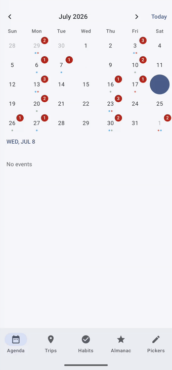

# Orrery

[](https://central.sonatype.com/artifact/me.kozakov.orrery/orrery-compose)
[](https://github.com/koza4e4ok/Orrery/actions/workflows/ci.yml)
[](https://developer.android.com/studio/releases/platforms)
[](LICENSE)

**Orrery is an Android calendar library for Jetpack Compose** — a fully
composable month/week/year calendar with Material 3 theming, flexible selection, and an
optional Chinese lunisolar module. It's distributed as Maven Central artifacts you add to
your app's Gradle dependencies (see [Installation](#installation)); there's no view
subclassing or XML.

It's a full rewrite of [CalendarView](https://github.com/huanghaibin-dev/CalendarView)
with composable slots instead of view subclassing, snapshot state instead of listener
interfaces, and an optional Chinese lunisolar artifact.

<p align="center">
  
</p>

**Requirements:** Android `minSdk 23` · Jetpack Compose (Material 3) · Kotlin · JDK 17.
Built on [`kotlinx-datetime`](https://github.com/Kotlin/kotlinx-datetime).

## Installation

The library ships three artifacts on **Maven Central** under the group
`me.kozakov.orrery`:

| Artifact                           | Contents                                                                   |
| ---------------------------------- | -------------------------------------------------------------------------- |
| `me.kozakov.orrery:orrery-core`    | Pure-Kotlin calendar models, grid math and selection engine                |
| `me.kozakov.orrery:orrery-compose` | Jetpack Compose calendar composables with Material3 theming                |
| `me.kozakov.orrery:orrery-lunar`   | Chinese lunisolar calendar, solar terms and festivals as a DayInfoProvider |

`orrery-compose` already depends on `orrery-core`, so most apps only need the two
lines below. Make sure Maven Central is in your repositories (usually in
`settings.gradle.kts` under `dependencyResolutionManagement`):

```kotlin
// settings.gradle.kts
dependencyResolutionManagement {
    repositories {
        mavenCentral()
    }
}
```

```kotlin
// app/build.gradle.kts
dependencies {
    implementation("me.kozakov.orrery:orrery-compose:0.3.0")
    // Optional Chinese lunisolar labels:
    implementation("me.kozakov.orrery:orrery-lunar:0.3.0")
}
```

Using a [version catalog](https://docs.gradle.org/current/userguide/version_catalogs.html)
(`gradle/libs.versions.toml`)?

```toml
[versions]
orrery = "0.3.0"

[libraries]
orrery-compose = { module = "me.kozakov.orrery:orrery-compose", version.ref = "orrery" }
orrery-lunar   = { module = "me.kozakov.orrery:orrery-lunar",   version.ref = "orrery" }
```

```kotlin
// app/build.gradle.kts
dependencies {
    implementation(libs.orrery.compose)
    implementation(libs.orrery.lunar) // optional
}
```

> **Snapshots:** development builds are published as `0.3.1-SNAPSHOT` to the Central
> snapshots repository. To use them, add
> `maven("https://central.sonatype.com/repository/maven-snapshots/")` to your repositories
> and depend on the `-SNAPSHOT` version.

## Quick start

```kotlin
@Composable
fun CalendarScreen() {
    val today = remember { currentDate() }
    val selection = rememberCalendarSelectionState(mode = SelectionMode.Range(maxDays = 14))
    val lunar = remember { LunarDayInfoProvider() } // optional, from orrery-lunar

    HorizontalCalendar(
        state = rememberCalendarState(),
        showWeekNumbers = true,
        dayContent = { day ->
            DefaultDay(
                day = day,
                selectionState = selection,
                today = today,
                info = lunar.info(day.date),
                decorators = listOf(
                    DayDecorators.eventDots { date -> eventColors[date].orEmpty() },
                    DayDecorators.progressRing { date -> habits[date] }, // 0f..1f
                ),
            )
        },
    )
}
```

The sample app (`sample/`) is five product-style screens: an Agenda with a
collapsible calendar and named events, a Trips booking flow with drag-select,
nightly prices and blackout dates, a Habits tracker with streaks and animated
progress rings, a Chinese Almanac backed by `orrery-lunar`, and a Pickers screen
demonstrating both date picker dialogs.

## Features

- Month (`HorizontalCalendar`), vertical list (`VerticalCalendar`), single-week
  (`WeekCalendar`) and year-overview (`YearCalendar`) composables
- `CollapsibleCalendarScaffold`: month collapses to a week row as the content scrolls
- Selection modes: single (with optional auto-advance), range (min/max), multi,
  plus long-press **drag-to-select**
- `OrreryDatePickerDialog` / `OrreryDateRangePickerDialog`: Material 3-shaped dialogs
  (slot-based confirm/dismiss buttons) with calendar and locale-aware text-input modes
- First-class unavailable dates: `DisabledDates` (dates, ranges, days of week,
  before/after, predicates) blocks selection and renders disabled automatically
- Per-state day styling: `CalendarDayColors` + `CalendarDayShapes` with
  today-indicator variants (ring, filled, underline), segmented or banded
  in-range fills, and optional selected-day elevation
- Stackable day decorators: event dots, progress rings/bars, strikethrough,
  underline, and a GitHub-style heatmap — plus a raw `DayDecorator` DrawScope
  escape hatch
- `HeatmapCalendar` contribution graph and `HeatmapMonth` heat tiles with
  active-day/streak summaries (`heatmapSummary` in orrery-core)
- `CalendarNavHeader` prev/next navigation with animated title and
  `MonthYearPicker` decade/year/month jump picker
- Scroll-to-today, selection haptics, range-fill animation, and
  keyboard/D-pad navigation with month-edge paging
- Flow observation (`visibleMonths`, `selectionChanges`), selection presets
  with a validated programmatic setter, count badges, and animated
  decorator values via `rememberAnimatedDayValues`
- Material3 theming — dark mode and dynamic color for free; all colors overridable
- Accessibility semantics, RTL mirroring, locale-driven names and first day of week
- Week numbers (ISO by default, custom `weekNumber` slot) and sticky month headers
- `orrery-lunar`: Gregorian↔lunar conversion (golden-tested against the original
  for all 73,049 days of 1900–2099), astronomical 24 solar terms, traditional and
  Gregorian festivals, 干支 year names, zh-CN/zh-TW/zh-HK string variants

## Usage

Everything below ships in `orrery-compose` unless marked otherwise. All dates are
[`kotlinx-datetime`](https://github.com/Kotlin/kotlinx-datetime) types (`LocalDate`,
`YearMonth`, `DayOfWeek`).

### Calendars

Five composables cover the common layouts. Each takes a state holder and a
`dayContent` slot; `DefaultDay` is the batteries-included cell, but the slot
accepts any composable.

| Composable                    | Layout                                                |
| ----------------------------- | ----------------------------------------------------- |
| `HorizontalCalendar`          | One month per page, swipe horizontally                |
| `VerticalCalendar`            | Continuous month list, optional sticky headers        |
| `WeekCalendar`                | Single week strip, one week per page                  |
| `YearCalendar`                | Year overview with a tappable mini-month grid         |
| `CollapsibleCalendarScaffold` | Month that collapses to a week row as content scrolls |

```kotlin
HorizontalCalendar(state = rememberCalendarState()) { day -> DefaultDay(day) }

VerticalCalendar(state = state, stickyMonthHeaders = true) { day -> DefaultDay(day) }

WeekCalendar(
    state = rememberWeekCalendarState(startDate = start, endDate = end),
) { day -> DefaultDay(day) }

YearCalendar(onMonthClick = { month -> /* navigate */ })
```

`CollapsibleCalendarScaffold` pairs a month state with a week state and collapses
between them as its `content` scrolls (the Agenda screen in the sample):

```kotlin
CollapsibleCalendarScaffold(
    calendarState = rememberCalendarState(),
    weekState = rememberWeekCalendarState(startDate = start, endDate = end),
    dayContent = { day -> DefaultDay(day, selectionState = selection) },
) {
    LazyColumn { /* scrolling this collapses the month to a week row */ }
}
```

`HorizontalCalendar` and `WeekCalendar` also handle keyboard/D-pad navigation
(with month-edge paging) and animate height between 4/5/6-week months.

### Calendar state and navigation

`rememberCalendarState` pins the month range, the first visible month, the first
day of the week (locale-derived by default), and the `OutDateStyle` (how
leading/trailing cells fill). The state exposes scrolling as suspend functions
and the visible month as snapshot state:

```kotlin
val state = rememberCalendarState(
    startMonth = YearMonth(2020, 1),
    endMonth = YearMonth(2030, 12),
    outDateStyle = OutDateStyle.EndOfGrid, // always six rows
)
val scope = rememberCoroutineScope()

state.firstVisibleMonth                       // snapshot-observable
scope.launch { state.animateScrollToToday() } // also: scrollToMonth, (animate)ScrollToDate
state.updateRange(newStart, newEnd)           // grow/shrink the range in place
```

`CalendarNavHeader` gives you prev/next chevrons around an animated title;
`MonthYearPicker` is a month/year/decade jump grid you can host in a dialog,
dropdown, or in place of the month grid:

```kotlin
CalendarNavHeader(state = state, onTitleClick = { showJumpPicker = true })

if (showJumpPicker) {
    MonthYearPicker(
        current = state.firstVisibleMonth,
        range = YearMonth(2020, 1)..YearMonth(2030, 12),
        onSelect = { month ->
            showJumpPicker = false
            scope.launch { state.scrollToMonth(month) }
        },
    )
}
```

Observe scrolling and selection as Flows — the sample's Agenda screen loads
events for whichever month scrolls into view:

```kotlin
LaunchedEffect(state) {
    state.visibleMonths().collect { month -> loadEvents(month) }
}
// also: WeekCalendarState.visibleWeeks(), CalendarSelectionState.selectionChanges()
```

### Selection

`rememberCalendarSelectionState` holds the selection and validates every change.
Pass it to `DefaultDay` (taps just work) and to a calendar's `dragSelection`
parameter for long-press drag-to-select ranges:

```kotlin
val selection = rememberCalendarSelectionState(
    mode = SelectionMode.Range(minDays = 2, maxDays = 14),
    disabled = blackoutDates,
    onEvent = { event ->
        // OutOfRange, Intercepted, RangeTooShort, RangeTooLong, TooManyDays
        snackbar("That stay is unavailable")
    },
)

VerticalCalendar(state = state, dragSelection = selection) { day ->
    DefaultDay(day, selectionState = selection)
}
```

Modes (`orrery-core`):

- `SelectionMode.Single(autoAdvance = false)` — one day; `autoAdvance` keeps a
  day selected while paging months (policy via `AutoSelectDay`)
- `SelectionMode.Range(minDays, maxDays)` — start/end range with inclusive
  day-count limits
- `SelectionMode.Multi(maxCount)` — toggle set, optionally capped
- `SelectionMode.None` — display only

Read and write programmatically — writes go through the same validation as taps,
so an invalid proposal is rejected and reported through `onEvent`:

```kotlin
selection.selection.range          // ClosedRange<LocalDate>? for Range mode
selection.set(SelectionPresets.nextWeekend(from = today)) // presets are pure factories
selection.clear()
```

`SelectionPresets` (in `orrery-core`) also has `nextDays`, `thisWeek`,
`thisMonth`, `lastNDays`, `thisQuarter`, and `workweek`.

### Disabled dates

`DisabledDates` is an immutable union built with a DSL. The selection engine
blocks these dates (single/multi taps, range endpoints, and any date inside a
proposed range) and `DefaultDay` renders them unavailable — no extra wiring:

```kotlin
val blackoutDates = DisabledDates {
    dates(LocalDate(2026, 12, 25))
    range(maintenanceStart..maintenanceEnd)
    daysOfWeek(DayOfWeek.SATURDAY, DayOfWeek.SUNDAY)
    before(currentDate())            // strictly before
    predicate { it.day == 13 }       // anything callable
}
```

### Day cells and theming

`DefaultDay` renders selection fill, in-range band, today indicator, a secondary
label (`info`), and stacked decorators. Colors and shapes come from two
immutable holders with Material 3 defaults:

```kotlin
DefaultDay(
    day = day,
    selectionState = selection,
    info = DayInfo(label = "$99"),        // small label under the day number
    showOutDates = false,                 // hide leading/trailing month days
    selectedElevation = 2.dp,
    colors = CalendarDefaults.dayColors(
        selectedContainerColor = MaterialTheme.colorScheme.tertiary,
    ),
    shapes = CalendarDefaults.dayShapes(
        dayShape = RoundedCornerShape(12.dp),
        inRangeShape = RoundedCornerShape(12.dp), // non-rect = segmented per-day fill
        todayIndicator = TodayIndicator.FilledCircle, // or Ring(width), Underline, None
    ),
    onClick = { day -> /* optional, in addition to selection */ },
)
```

`CalendarDayColors` covers every state (today, selected, in-range, out-date,
unavailable, label); anything you don't override follows the Material theme, so
dark mode and dynamic color work for free. The week header, week-number cell,
and month title are also slots — the defaults are `CalendarDefaults.WeekHeader`,
`CalendarDefaults.WeekNumber` (ISO week), and `CalendarDefaults.MonthTitle`.

### Decorators

Decorators draw data onto day cells without per-cell composables — they are
plain `DrawScope` lambdas keyed by date, stackable in one list:

```kotlin
val decorators = listOf(
    DayDecorators.eventDots { date -> eventColors[date].orEmpty() },
    DayDecorators.progressRing { date -> habitProgress[date] },   // 0f..1f
    DayDecorators.progressBar { date -> downloadProgress[date] },
    DayDecorators.badge { date -> unreadCount(date) },            // count bubble
    DayDecorators.heatmap { date -> activity[date] },             // GitHub-style
    DayDecorators.strikethrough { date -> date in cancelled },
    DayDecorators.underline { date -> date in deadlines },
)

DefaultDay(day = day, decorators = decorators)
```

Most factories are `@Composable` (they read theme colors) — call them once
outside `dayContent` and remember the list, not inside each cell. For anything
else, implement `DayDecorator` directly and draw with the full `DrawScope`;
`layer` picks `Behind` or `Over` the day number.

To animate decorator data, animate in composition and read the animated value in
the lookup — `rememberAnimatedDayValues` packages the idiom:

```kotlin
val animated = rememberAnimatedDayValues(habitProgress) // Map<LocalDate, Float>
DefaultDay(
    day = day,
    decorators = listOf(DayDecorators.progressRing(progress = animated)),
)
// when habitProgress[date] changes 0.4 -> 0.8, the ring eases over 300 ms
```

### Heatmaps

`HeatmapCalendar` is the GitHub-style contribution graph: one column per week
over any date range, scrolled to the most recent data, with month labels,
weekday labels, a legend, and a summary slot ("N active days · M-day streak",
computed by orrery-core's pure `heatmapSummary()`). `HeatmapMonth` is a static
month grid of the same tiles for dashboards. Both take the decorator-style
`intensity` lookup — null means no data — and an optional tap callback:

```kotlin
HeatmapCalendar(
    intensity = { date -> activity[date] },          // 0f..1f, null = empty cell
    state = rememberHeatmapCalendarState(),          // trailing 365 days by default
    onDayClick = { date -> showDetail(date) },
    strings = HeatmapDefaults.strings(legendLess = "Weniger", legendMore = "Mehr"),
)

HeatmapMonth(yearMonth = YearMonth(2026, 7), intensity = { activity[it] }, showDayNumbers = true)
```

The default color scale quantizes into five buckets from `surfaceVariant` to
`primary`; pass any `colorScale: (Float) -> Color` (a continuous lerp works
too). Cell accessibility descriptions bucket intensity into five spoken levels.

### Date picker dialogs

M3-shaped dialog wrappers — `OrreryDatePickerDialog` (compact, single date) and
`OrreryDateRangePickerDialog` (full-screen, drag-select range) — with the same
`onDismissRequest`/`confirmButton` slot API as `androidx.compose.material3.DatePickerDialog`
(the compact dialog also takes a `dismissButton` slot; the range dialog dismisses via its
close glyph instead), plus a locale-aware text-input mode:

```kotlin
@Composable
fun PickDateButton() {
    var showDialog by remember { mutableStateOf(false) }
    val state = rememberOrreryDatePickerState()

    Button(onClick = { showDialog = true }) { Text("Pick date") }

    if (showDialog) {
        OrreryDatePickerDialog(
            onDismissRequest = { showDialog = false },
            confirmButton = {
                TextButton(
                    onClick = { showDialog = false },
                    enabled = state.selectedDate != null,
                ) { Text("OK") }
            },
            dismissButton = { TextButton(onClick = { showDialog = false }) { Text("Cancel") } },
            state = state,
        )
    }
}
```

Read `state.selectedDate` (or `selectedStartDate`/`selectedEndDate` on the range state) in
your confirm button. The state factories accept an initial date/range, a
`yearRange`, `disabledDates`, and (range only) `minDays`/`maxDays`; programmatic
writes are validated like taps. Both dialogs localize entirely through
`DatePickerStrings` — override any message via `DatePickerDefaults.strings(...)`.

```kotlin
val range = rememberOrreryDateRangePickerState(minDays = 2, disabledDates = blackoutDates)

OrreryDateRangePickerDialog(
    onDismissRequest = { showDialog = false },
    confirmButton = {
        TextButton(onClick = { save(range.selectedStartDate, range.selectedEndDate) }) {
            Text("Save")
        }
    },
    state = range,
    strings = DatePickerDefaults.strings(rangeTitle = "Select your stay"),
)
```

### Day info and the lunar module

`DayInfoProvider` (in `orrery-core`) supplies a secondary per-day label —
holidays, prices, anything. `orrery-lunar` ships one for the Chinese lunisolar
calendar (valid 1900–2099), plus the underlying conversions:

```kotlin
val lunar = remember { LunarDayInfoProvider() } // or ChineseVariant.TRADITIONAL_TW / _HK

HorizontalCalendar(state = state) { day ->
    DefaultDay(day = day, info = lunar.info(day.date))
    // label priority: solar term > Gregorian festival > lunar festival > lunar day
}

date.toLunarDate()                  // Gregorian -> LunarDate (and back: toLocalDate())
solarTermsFor(2026)                 // Map<LocalDate, SolarTerm>, all 24 terms
SolarTerm.entries[0].displayName(ChineseVariant.SIMPLIFIED)
trunkBranchYear(2026)               // 干支 year name
```

Your own provider is one function:

```kotlin
val holidays = object : DayInfoProvider {
    override fun info(date: LocalDate): DayInfo? =
        publicHolidays[date]?.let { DayInfo(label = it, isHoliday = true) }
}
```

### Utilities

- `currentDate()` / `currentYearMonth()` — today in the system time zone
- `firstDayOfWeekFromLocale()` — locale-preferred first day of the week
- `DayOfWeek.displayName(narrow)`, `Month.displayName(short)`,
  `YearMonth.displayName()` — localized names
- `LocalDate.isoWeekNumber()` (`orrery-core`) — ISO-8601 week of year

### Using orrery-core without Compose

`orrery-core` is a plain Kotlin JVM library. `monthGrid`/`weekGrid` build the
day grids, `SelectionEngine` validates clicks and programmatic proposals as pure
functions, and `DisabledDates`/`SelectionPresets`/`daysOfWeek` work anywhere —
useful for view-based UIs, widgets, or server-side rendering.

## Development

```bash
# Full verification (what CI runs):
./gradlew ktlintCheck detekt checkKotlinAbi \
  :orrery-core:test :orrery-lunar:test \
  :orrery-compose:testDebugUnitTest :orrery-compose:verifyRoborazziDebug \
  :sample:assembleDebug

./gradlew :orrery-compose:recordRoborazziDebug  # refresh screenshot goldens
./gradlew updateKotlinAbi                          # refresh ABI dumps after API changes
```

Releases are documented in [docs/RELEASING.md](docs/RELEASING.md).

## License

Apache License 2.0 — see [LICENSE](LICENSE). Ports algorithms and data tables from
[CalendarView](https://github.com/huanghaibin-dev/CalendarView) (Apache 2.0); see [NOTICE](NOTICE).
